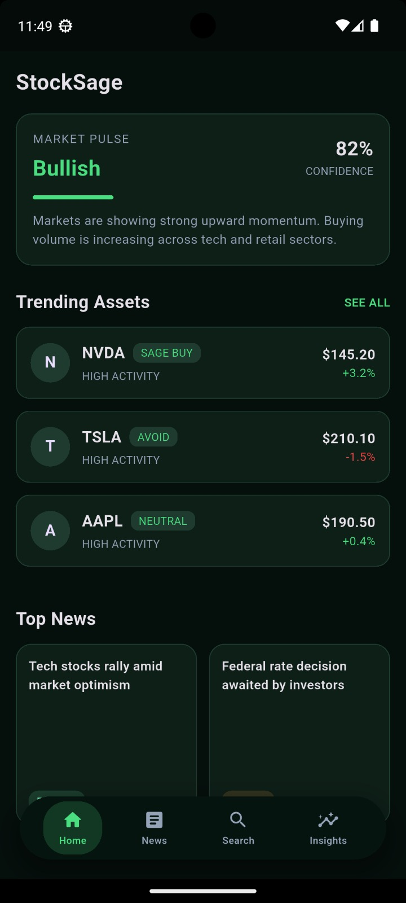
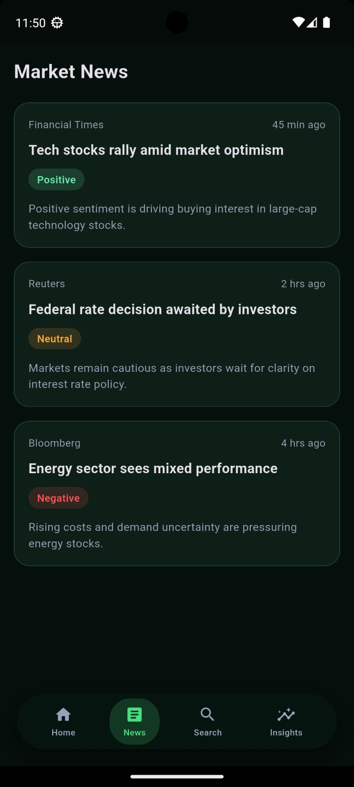
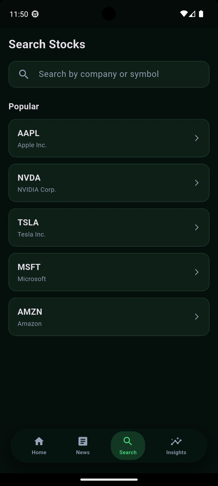
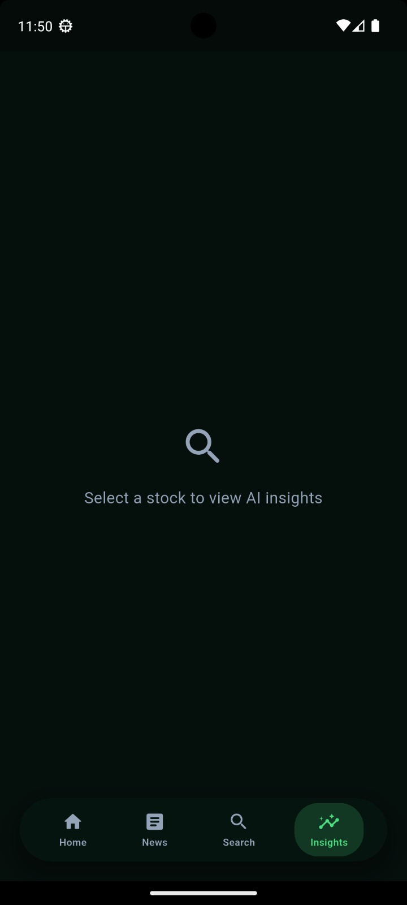

📈 StockSage

AI-Inspired Stock Insight Mobile App (Flutter Frontend)

StockSage is a modern, dark-themed mobile application built using Flutter, designed to visualize stock market trends, insights, and news in a clean, intuitive interface inspired by real-world trading platforms.

This repository contains the frontend implementation only,

## 📸 Screenshots

### Dashboard

### News

### Search

### Insights

